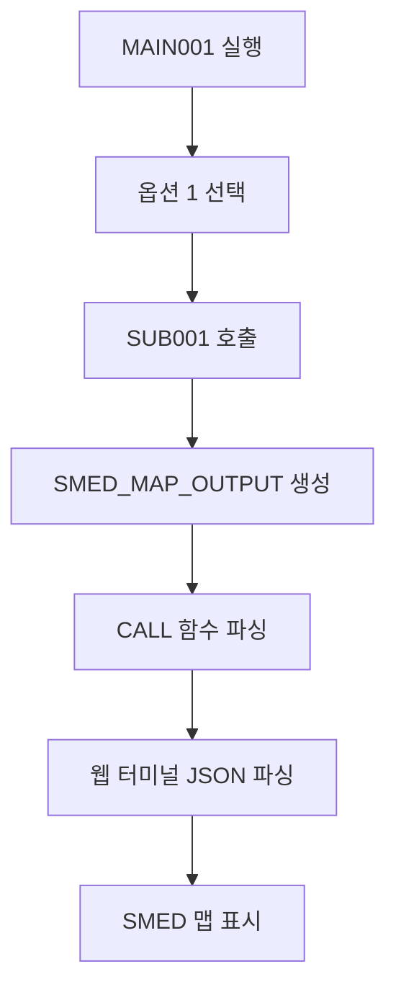

# OpenASP AX - 통합 API 문서

## 📋 개요

OpenASP AX 프로젝트의 모든 API, 서비스, 인터페이스를 통합 관리하는 문서입니다.

**최종 업데이트**: 2025-08-01  
**프로젝트**: OpenASP AX - 레거시 마이그레이션 플랫폼  
**범위**: 전체 시스템 API 통합 문서

## 🏗️ 시스템 아키텍처

### 서비스 포트 구성
- **3000**: SMED Map Viewer (화면 맵 뷰어)
- **3003**: Python EBCDIC 변환 서비스
- **3005**: OpenASP Refactor 메인
- **3007**: ASP Manager
- **3008**: ASP Manager 백엔드
- **8000**: API 서버

## 🗂️ 12. Layout 파일 관리 API (2025-08-03 신규)

### 12.1 Layout 카탈로그 조회 API

#### **GET /api/catalog/layout**
**기능**: catalog.json에서 TYPE="LAYOUT"인 모든 항목 조회  
**용도**: 데이터셋 변환 페이지의 레이아웃 선택 드롭다운

```bash
GET http://localhost:8000/api/catalog/layout
```

**응답 예시**:
```json
{
  "SAM001": {
    "volume": "DISK01",
    "library": "LAYOUT",
    "name": "SAM001",
    "description": "LAYOUT: SAM001 - Sequential Access Method layout definition",
    "recfm": "FB",
    "lrecl": "80"
  }
}
```

### 12.2 Layout 파일 내용 조회 API

#### **GET /api/layout/content/{layout_name}**
**기능**: 실제 서버 파일시스템에서 LAYOUT 파일을 읽고 SJIS → Unicode 변환  
**용도**: 레이아웃 프리뷰 표시

```bash
GET http://localhost:8000/api/layout/content/SAM001
```

**응답 예시**:
```json
{
  "success": true,
  "layout_name": "SAM001",
  "volume": "DISK01",
  "library": "LAYOUT",
  "content": "            01 OUT1.\n               03 PNO      PIC 9(5).\n               03 PNAME    PIC X(28).\n               03 PTRAIL   PIC X(05).\n               03 FILLER   PIC X(42).\n",
  "file_path": "/home/aspuser/app/volume/DISK01/LAYOUT/SAM001.LAYOUT",
  "description": "LAYOUT: SAM001 - Sequential Access Method layout definition",
  "recfm": "FB",
  "lrecl": "80"
}
```

### 12.3 파일 경로 구조

**서버 파일 위치**: `volume/{VOLUME}/{LIBRARY}/{FILENAME}.LAYOUT`
- 예시: `/home/aspuser/app/volume/DISK01/LAYOUT/SAM001.LAYOUT`

**catalog.json 등록 형식**:
```json
{
  "DISK01": {
    "LAYOUT": {
      "SAM001": {
        "TYPE": "LAYOUT",
        "RECFM": "FB",
        "LRECL": "80",
        "DESCRIPTION": "LAYOUT: SAM001 - Sequential Access Method layout definition",
        "CREATED": "2025-08-03T12:05:00Z",
        "UPDATED": "2025-08-03T12:05:00Z"
      }
    }
  }
}
```

### 12.4 인코딩 변환

- **서버 파일**: SJIS 인코딩으로 저장
- **API 응답**: Unicode (UTF-8)로 자동 변환
- **변환 도구**: `smart_read_file()` 함수 사용 (encoding_manager.py)

### 12.5 오류 처리

**Layout이 catalog에 없는 경우**:
```json
{
  "error": "Layout SAM001 not found in catalog"
}
```

**파일이 서버에 없는 경우**:
```json
{
  "error": "Layout file not found at /home/aspuser/app/volume/DISK01/LAYOUT/SAM001.LAYOUT"
}
```

## 📂 Catalog 구조 (파일 타입별 라이브러리)

### DISK01 라이브러리 구조
```json
{
  "DISK01": {
    "TESTLIB": { /* 기존 데이터셋 및 일반 프로그램 */ },
    "PRODLIB": { /* 프로덕션 라이브러리 */ },
    "XMLLIB": { /* COBOL 카피북 라이브러리 */ },
    "JAVA": { /* Java 프로그램 전용 라이브러리 */ },
    "COB": { /* COBOL 프로그램 전용 라이브러리 */ },
    "CL": { /* CL 명령어 전용 라이브러리 */ },
    "SMED": { /* SMED 맵 전용 라이브러리 */ }
  }
}
```

### 프로그램 호출 규칙
- **호출명**: 8바이트 이내, 확장자 없음 (예: `MAIN001`)
- **검색 순서**: JAVA → COB → CL → TESTLIB → PRODLIB
- **라이브러리별 격납**: 파일 타입에 따라 자동 분류

## 🎯 1. 프로그램 실행 API

### 1.1 Java 프로그램 호출

#### **MAIN001** (Java)
**위치**: `DISK01.JAVA.MAIN001`  
**클래스**: `com.openasp.main.Main001`

```java
// Spring Bean으로 호출
@Autowired
private Main001 main001;

Map<String, String> input = new HashMap<>();
input.put("terminal_id", "TERM001");
JSONResponse response = main001.execute(input);
```

**응답 구조**:
```json
{
  "success": true,
  "program": "MAIN001",
  "title": "=== 管理メニュー ===",
  "selected_program": "INQUIRY1",
  "status_message": "参照処理を開始します",
  "return_code": 0,
  "message": "プログラムが正常に実行されました",
  "timestamp": 1234567890
}
```

#### **ASP 시스템에서 호출**
```bash
CALL PGM-MAIN001.JAVA,VOL-DISK01
```

#### **SUB001** (Java) - 사원 정보 표시
**위치**: `DISK01.JAVA.SUB001`  
**클래스**: `com.openasp.sub.SUB001`  
**기능**: 사원 정보 조회 및 SMED 맵 표시

```java
// ASP 시스템에서 호출
CALL PGM-SUB001.JAVA,VOL-DISK01
```

**SMED 맵 출력 형식**:
```json
{
  "map_name": "SUB001",
  "title": "社員情報照会",
  "rows": 24,
  "cols": 80,
  "fields": [
    {
      "row": 1,
      "col": 30,
      "text": "社員情報照会",
      "type": "static"
    },
    {
      "row": 6,
      "col": 5,
      "text": "00001",
      "type": "data"
    },
    {
      "row": 6,
      "col": 15,
      "text": "田中太郎",
      "type": "data"
    }
  ]
}
```

### 1.2 COBOL 프로그램 호출

#### **MAIN001** (COBOL)
**위치**: `/home/aspuser/app/server/system-cmds/MAIN001.cob`  
**인코딩**: SHIFT_JIS  
**패턴**: Fujitsu ASP COBOLG

```bash
# ASP CLI에서 호출
CALL PGM-MAIN001.COB,VOL-DISK01
```

### 1.3 CL 명령어 호출
```bash
CALL PGM-EMPINQ.CL,VOL-DISK01
```

## 🖥️ 2. SMED Map Display API

### 2.1 WebSocket SMED 서비스

#### **Position-based SMED Display**
```javascript
// WebSocket 연결
const ws = new WebSocket('ws://localhost:8000/smed');

// SMED 맵 표시
ws.send(JSON.stringify({
  action: 'display_map',
  map_name: 'MAIN001',
  terminal_id: 'TERM001',
  fields: [
    { row: 5, col: 20, value: '=== 管理メニュー ===' },
    { row: 7, col: 25, value: '１）参照' },
    { row: 9, col: 25, value: '２）追加' },
    { row: 11, col: 25, value: '３）更新' },
    { row: 13, col: 25, value: '４）削除' }
  ]
}));
```

#### **SMED Map 등록**
**위치**: `DISK01.SMED.MAIN001`
```json
{
  "TYPE": "MAP",
  "MAPTYPE": "SMED", 
  "MAPFILE": "MAIN001",
  "DESCRIPTION": "SMED map: MAIN001 - Main menu map for Japanese management interface",
  "ROWS": 24,
  "COLS": 80
}
```

### 2.2 🚀 통합 SMED 맵 표시 시스템 (2025-08-01 신규)

**개요**: Java 프로그램에서 직접 SMED 맵 데이터를 출력하고 웹 터미널에서 실시간으로 표시하는 통합 시스템

#### **시스템 플로우**


#### **Java 프로그램 SMED 출력 형식**
```java
// SUB001.java에서 SMED 맵 출력
System.out.println("SMED_MAP_OUTPUT:");
System.out.println(smedJsonString);
```

**SMED JSON 구조**:
```json
{
  "map_name": "SUB001",
  "title": "社員情報照会",
  "rows": 24,
  "cols": 80,
  "fields": [
    {
      "row": 1,
      "col": 30,
      "text": "社員情報照会",
      "type": "static"
    },
    {
      "row": 6,
      "col": 5,
      "text": "00001",
      "type": "data"
    }
  ]
}
```

#### **CALL 함수 SMED 처리**
**파일**: `server/system-cmds/functions/call.py`

```python
def _process_java_output(output: str, volume: str, library: str, program: str):
    """SMED_MAP_OUTPUT 마커를 찾아 JSON 데이터 파싱"""
    if "SMED_MAP_OUTPUT:" in output:
        # JSON 블록 추출 및 파싱
        smed_data = extract_and_parse_json(output)
        # WebSocket으로 브로드캐스트
        _send_smed_to_websocket(smed_data, program)
```

#### **웹 터미널 SMED 통합**
**파일**: `src/components/AspCliWebTerminal.tsx`

```typescript
// 명령 출력에서 SMED_MAP_OUTPUT 직접 파싱
if (output.includes('SMED_MAP_OUTPUT:')) {
  const smedData = parseJsonFromOutput(output);
  
  // SmedMapDisplay 호환 형식으로 변환
  const convertedFields = smedData.fields.map((field, index) => ({
    name: `field_${index}`,
    row: field.row,
    col: field.col,
    length: field.text?.length || 10,
    value: field.text || '',
    prompt: field.type === 'static' ? field.text : undefined,
    type: field.type
  }));
  
  setSmedMapData({ fields: convertedFields });
  setShowSmedMap(true);
}
```

#### **Socket.IO 브로드캐스트 API**
**엔드포인트**: `POST /broadcast-smed`

```bash
POST http://localhost:8000/broadcast-smed
Content-Type: application/json

{
  "type": "smed_map",
  "program": "SUB001",
  "map_file": "SUB001",
  "fields": { /* SMED 데이터 */ },
  "timestamp": "2025-08-01T12:00:00Z"
}
```

#### **디버그 로깅 시스템**
**설정 파일**: `config/catalog.json`

```json
{
  "LOG": {
    "LEVEL": "DEBUG",
    "AVAILABLE_LEVELS": ["TRACE", "DEBUG", "INFO", "WARN", "ERROR"],
    "COMPONENTS": {
      "WEBSOCKET_HUB": "DEBUG",
      "JAVA_CALL": "DEBUG",
      "WEB_TERMINAL": "DEBUG",
      "SMED_PROCESSING": "DEBUG",
      "MAIN001": "TRACE",
      "SUB001": "DEBUG",
      "CALL_FUNCTION": "TRACE"
    },
    "OUTPUT": {
      "CONSOLE": true,
      "FILE": "/tmp/asp_debug.log",
      "MAX_SIZE": "10MB",
      "ROTATE": true
    }
  }
}
```

#### **사용 예시**
```bash
# 웹 터미널에서 실행
CALL PGM-MAIN001.JAVA,VOL-DISK01

# 1 입력 후 엔터
# → SUB001 사원 정보 화면이 SMED 맵으로 표시됨
```

## 🔄 3. 문자 인코딩 API

### 3.1 Python EBCDIC 변환 서비스 (포트 3003)

#### **EBCDIC → ASCII 변환**
```bash
POST http://localhost:3003/api/v1/convert/ebcdic-to-ascii
Content-Type: application/json

{
  "data": "EBCDIC 데이터",
  "encoding": "JP",
  "sosi_handling": "space"
}
```

#### **ASCII → EBCDIC 변환**
```bash
POST http://localhost:3003/api/v1/convert/ascii-to-ebcdic
Content-Type: application/json

{
  "data": "ASCII 데이터", 
  "encoding": "JP"
}
```

### 3.2 Java Encoding Service
```java
@Service
public class EncodingService {
    public String convertToSjis(String utf8Text);
    public String convertFromSjis(String sjisText);
}
```

## 💾 4. 파일 시스템 API

### 4.1 ASP CLI 명령어

#### **라이브러리 관리**
```bash
# 라이브러리 생성
CRTLIB LIB-XMLLIB,VOL-DISK01

# 라이브러리 삭제  
DLTLIB LIB-TESTLIB,VOL-DISK01

# 라이브러리 작업
WRKLIB LIB-TESTLIB,VOL-DISK01
```

#### **파일 관리**
```bash
# 파일 생성
CRTFILE FILE-EMPLOYEE.FB,LIB-TESTLIB,VOL-DISK01

# 파일 삭제
DLTFILE FILE-EMPLOYEE.FB,LIB-TESTLIB,VOL-DISK01

# 파일 표시
DSPFD FILE-EMPLOYEE.FB,LIB-TESTLIB,VOL-DISK01
```

### 4.2 볼륨 관리
```bash
# 볼륨 작업
WRKVOL

# 객체 작업  
WRKOBJ OBJ-*,LIB-TESTLIB,VOL-DISK01
```

## 🔗 5. 프로그램 호출 서비스

### 5.1 CallService Interface
```java
public interface CallService {
    JSONResponse callProgram(String programName, Map<String, String> context);
    boolean isProgramAvailable(String programName);
    List<String> getAvailablePrograms();
}
```

### 5.2 프로그램 검색 순서
1. **JAVA 라이브러리** 검색
2. **COB 라이브러리** 검색  
3. **CL 라이브러리** 검색
4. **TESTLIB** 검색
5. **PRODLIB** 검색

## 📊 6. 데이터베이스 API

### 6.1 Dataset 접근
```java
// FB (Fixed Block) 데이터셋
Dataset dataset = datasetService.openDataset("EMPLOYEE.FB", "TESTLIB");
Record record = dataset.read();
dataset.write(record);
dataset.close();
```

### 6.2 SAM (Sequential Access Method)
```java
// SAM 파일 처리
SamFile samFile = samService.openSam("CUSTOMER.SAM001", "TESTLIB");
samFile.writeRecord(data);
samFile.close();
```

## 🌐 7. 웹 인터페이스 API

### 7.1 ASP Manager (포트 3007)

#### **RAG 시스템**
```javascript
POST http://localhost:3007/api/chat
Content-Type: application/json

{
  "message": "How to create a library?",
  "language": "ja"
}
```

#### **시스템 모니터링**
```javascript
GET http://localhost:3007/api/system/status
```

### 7.2 OFASP Refactor (포트 3005)

#### **코드 변환**
```javascript
POST http://localhost:3005/api/convert/cobol
Content-Type: application/json

{
  "source_code": "COBOL 소스",
  "target_language": "java",
  "options": {
    "preserve_comments": true,
    "sjis_encoding": true
  }
}
```

## ⚙️ 8. 시스템 설정 및 구성

### 8.1 ASP 시스템 설정 파일

#### **설정 파일 위치**
**파일**: `/home/aspuser/app/config/asp.conf`  
**인코딩**: UTF-8  
**형식**: Properties 파일

#### **기본 설정 구조**
```properties
# WebSocket Hub timeout configuration
websocket.timeout=86400

# System parameters
system.debug=true
system.encoding=sjis
system.terminal.default=webui
```

#### **주요 설정 항목**

##### **WebSocket 설정**
```properties
# WebSocket Hub timeout (in seconds)
websocket.timeout=86400    # 24 hours (default)
# websocket.timeout=30     # 30 seconds (for testing)
# websocket.timeout=300    # 5 minutes
# websocket.timeout=3600   # 1 hour
# websocket.timeout=43200  # 12 hours
```

##### **시스템 설정**
```properties
# Debug mode
system.debug=true          # Enable debug logging

# Default encoding for server-side processing
system.encoding=sjis       # Shift_JIS encoding

# Default terminal ID
system.terminal.default=webui
```

### 8.2 설정 읽기 함수 사용법

#### **Java에서 설정 읽기**
```java
// MAIN001.java에서 WebSocket timeout 읽기 예제
private int getWebSocketTimeout() {
    int defaultTimeout = 86400; // Default 24 hours
    String configFile = "/home/aspuser/app/config/asp.conf";
    
    try {
        Properties props = new Properties();
        props.load(new FileInputStream(configFile));
        String timeoutStr = props.getProperty("websocket.timeout");
        
        if (timeoutStr != null) {
            int timeout = Integer.parseInt(timeoutStr.trim());
            System.out.println("[CONFIG] WebSocket timeout loaded: " + timeout + " seconds");
            return timeout;
        }
    } catch (Exception e) {
        System.err.println("[CONFIG] Could not load timeout: " + e.getMessage());
    }
    
    System.out.println("[CONFIG] Using default timeout: " + defaultTimeout + " seconds");
    return defaultTimeout;
}

// 디버그 모드 확인
private boolean isDebugMode() {
    String configFile = "/home/aspuser/app/config/asp.conf";
    try {
        Properties props = new Properties();
        props.load(new FileInputStream(configFile));
        return "true".equals(props.getProperty("system.debug", "false"));
    } catch (Exception e) {
        return false;
    }
}
```

#### **TypeScript/JavaScript에서 설정 읽기**
```typescript
// AspCliWebTerminal.tsx에서 설정 사용 예제
interface AspConfig {
  websocketTimeout: number;
  systemDebug: boolean;
  systemEncoding: string;
  defaultTerminal: string;
}

const loadAspConfig = async (): Promise<AspConfig> => {
  try {
    // API를 통해 설정 읽기
    const response = await fetch('/api/config/asp');
    const config = await response.json();
    
    return {
      websocketTimeout: parseInt(config['websocket.timeout']) || 86400,
      systemDebug: config['system.debug'] === 'true',
      systemEncoding: config['system.encoding'] || 'sjis',
      defaultTerminal: config['system.terminal.default'] || 'webui'
    };
  } catch (error) {
    console.error('[CONFIG] Failed to load asp.conf:', error);
    return {
      websocketTimeout: 86400,
      systemDebug: false,
      systemEncoding: 'sjis',
      defaultTerminal: 'webui'
    };
  }
};

// 사용 예시
const executeCommand = async (command: string) => {
  const config = await loadAspConfig();
  const timeoutMs = config.websocketTimeout * 1000; // Convert to milliseconds
  
  const confirmationPromise = new Promise<any>((resolve, reject) => {
    const timeout = setTimeout(() => {
      reject(new Error('Command execution timeout'));
    }, timeoutMs); // Use config value instead of hardcoded 60000
    
    // ... rest of the code
  });
};
```

#### **Python에서 설정 읽기**
```python
# api_server.py에서 설정 사용 예제
import configparser
import os

def load_asp_config():
    """Load ASP configuration from asp.conf"""
    config_file = "/home/aspuser/app/config/asp.conf"
    config = configparser.ConfigParser()
    
    try:
        # Properties 파일을 읽기 위해 section 추가
        with open(config_file, 'r', encoding='utf-8') as f:
            config_string = '[DEFAULT]\n' + f.read()
        config.read_string(config_string)
        
        return {
            'websocket_timeout': config.getint('DEFAULT', 'websocket.timeout', fallback=86400),
            'system_debug': config.getboolean('DEFAULT', 'system.debug', fallback=False),
            'system_encoding': config.get('DEFAULT', 'system.encoding', fallback='sjis'),
            'default_terminal': config.get('DEFAULT', 'system.terminal.default', fallback='webui')
        }
    except Exception as e:
        print(f"[CONFIG] Error loading asp.conf: {e}")
        return {
            'websocket_timeout': 86400,
            'system_debug': False,
            'system_encoding': 'sjis',
            'default_terminal': 'webui'
        }

# 사용 예시
config = load_asp_config()
websocket_timeout = config['websocket_timeout']
debug_mode = config['system_debug']
```

### 8.3 설정 API 엔드포인트

#### **설정 조회 API**
```bash
GET http://localhost:8000/api/config/asp
```

**응답**:
```json
{
  "websocket.timeout": "86400",
  "system.debug": "true",
  "system.encoding": "sjis",
  "system.terminal.default": "webui"
}
```

#### **설정 업데이트 API** (관리자만)
```bash
PUT http://localhost:8000/api/config/asp
Content-Type: application/json

{
  "websocket.timeout": "3600",
  "system.debug": "false"
}
```

### 8.4 설정 변경 시 고려사항

#### **타임아웃 설정 변경**
- **개발/테스트**: `websocket.timeout=30` (30초)
- **운영환경**: `websocket.timeout=86400` (24시간)
- **변경 후 서비스 재시작 필요**

#### **인코딩 설정**
- **서버 측**: `system.encoding=sjis` (고정)
- **클라이언트 측**: UTF-8 자동 변환
- **변경 시 데이터 호환성 확인 필요**

#### **디버그 모드**
- **개발환경**: `system.debug=true`
- **운영환경**: `system.debug=false`
- **로그 레벨과 성능에 영향**

## 🔐 9. 인증 및 보안

### 9.1 세션 관리
```json
{
  "session_id": "SESS_001",
  "terminal_id": "TERM001", 
  "user_id": "USER001",
  "language": "ja",
  "encoding": "sjis"
}
```

### 8.2 권한 관리
```java
@PreAuthorize("hasRole('ASP_USER')")
public JSONResponse executeProgram(String programName);
```

## 📝 9. 로깅 및 모니터링

### 9.1 로그 구조
```json
{
  "timestamp": "2025-08-01T12:00:00Z",
  "level": "INFO",
  "service": "MAIN001",
  "terminal_id": "TERM001",
  "message": "Program executed successfully",
  "execution_time": 150
}
```

### 9.2 성능 메트릭
- **응답 시간**: 평균 < 200ms
- **동시 사용자**: 최대 100명
- **메모리 사용량**: 모니터링 중

## 🚀 10. 통합 가이드

### 10.1 새 프로그램 등록

#### **Java 프로그램 등록**
```json
{
  "DISK01": {
    "JAVA": {
      "NEWPROG": {
        "TYPE": "PGM",
        "PGMTYPE": "JAVA",
        "PGMNAME": "com.openasp.sample.NewProgram",
        "CLASSFILE": "com/openasp/sample/NewProgram.class",
        "DESCRIPTION": "New sample program",
        "VERSION": "1.0",
        "CREATED": "2025-08-01T12:00:00Z",
        "UPDATED": "2025-08-01T12:00:00Z"
      }
    }
  }
}
```

#### **SMED 맵 등록**
```json
{
  "DISK01": {
    "SMED": {
      "NEWMAP": {
        "TYPE": "MAP",
        "MAPTYPE": "SMED",
        "MAPFILE": "NEWMAP", 
        "DESCRIPTION": "New SMED map",
        "ROWS": 24,
        "COLS": 80,
        "CREATED": "2025-08-01T12:00:00Z",
        "UPDATED": "2025-08-01T12:00:00Z"
      }
    }
  }
}
```

### 10.2 API 클라이언트 예제

#### **Java 클라이언트**
```java
@Component
public class AspApiClient {
    
    @Autowired
    private Main001 main001;
    
    public void executeMainMenu() {
        Map<String, String> input = new HashMap<>();
        input.put("terminal_id", "TERM001");
        
        JSONResponse response = main001.execute(input);
        if (response.isSuccess()) {
            logger.info("Main menu executed: {}", response.getMessage());
        }
    }
}
```

#### **Python 클라이언트**
```python
import requests
import json

def call_encoding_service(data, encoding='JP'):
    url = 'http://localhost:3003/api/v1/convert/ebcdic-to-ascii'
    payload = {
        'data': data,
        'encoding': encoding,
        'sosi_handling': 'space'
    }
    response = requests.post(url, json=payload)
    return response.json()
```

## 📞 11. 지원 및 문의

### 11.1 에러 코드
- **0**: 정상 완료
- **1**: 일반 에러
- **2**: 파일 없음
- **3**: 권한 없음
- **4**: 인코딩 에러
- **5**: 타임아웃

### 11.2 문제 해결
1. **로그 확인**: `/home/aspuser/app/logs/`
2. **서비스 상태**: `curl http://localhost:3003/health`
3. **catalog.json 검증**: 프로그램 등록 상태 확인

### 11.3 성능 최적화
- **연결 풀링**: DB 및 WebSocket 연결 최적화
- **캐싱**: 자주 사용되는 SMED 맵 캐싱
- **배치 처리**: 대용량 데이터 변환 시 배치 API 사용

---

**개발팀**: OpenASP AX Development Team  
**문서 관리**: Claude Code Assistant  
**버전**: 1.0.0