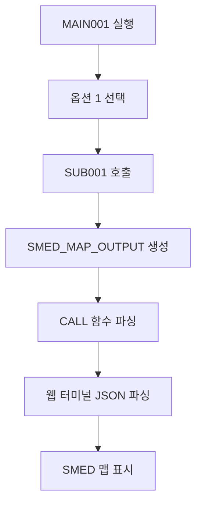

# OpenASP AX - 통합 API 문서

## 📋 개요

OpenASP AX 프로젝트의 모든 API, 서비스, 인터페이스를 통합 관리하는 문서입니다.

**최종 업데이트**: 2025-08-14  
**프로젝트**: OpenASP AX - 레거시 마이그레이션 플랫폼  
**범위**: 전체 시스템 API 통합 문서

## 🚨 **CRITICAL: 필수 File I/O 정책**

### **모든 Application은 dslock_suite API 사용 필수**

OpenASP AX 시스템에서 **모든 파일 I/O 작업**은 반드시 `ofasp-refactor/dslock_suite`에서 제공하는 API를 사용해야 합니다:

#### **필수 사용 대상**
- **C 애플리케이션**: `libdslock.so`, `libdsio.so` 링크 필수
- **Java 애플리케이션**: JNI 래퍼를 통한 dslock/dsio API 호출 필수  
- **Python 애플리케이션**: ctypes 또는 subprocess를 통한 dslockctl 호출 필수

#### **금지된 직접 파일 접근**
```c
// ❌ 절대 금지 - 직접 파일 접근
FILE* fp = fopen("/volume/DISK01/TESTLIB/EMPLOYEE.FB", "r");

// ✅ 필수 - dslock_suite API 사용
dsio_t handle;
dsio_open(&handle, "DISK01/TESTLIB/EMPLOYEE.FB", "READ", err, sizeof(err));
```

#### **데이터 무결성 보장**
- **락 메커니즘**: 동시 접근 시 데이터 손상 방지
- **Atomic 쓰기**: 중간 실패 시 데이터 일관성 보장
- **TTL 기반 정리**: 비정상 종료 시 자동 락 해제
- **catalog.json 연동**: 메타데이터 일치성 보장

#### **성능 및 확장성**
- **락 충돌 최소화**: 효율적인 락 레벨 관리 (SHR/OLD/MOD)
- **자동 정리**: 좀비 프로세스 락 자동 해제
- **모니터링**: 실시간 락 상태 추적 가능
- **관리 도구**: `dslockctl`로 문제 상황 즉시 해결

#### **호환성 및 확장**
- **레거시 지원**: 기존 ASP 데이터셋 포맷 완벽 지원
- **다중 언어**: C, Java, Python 모든 언어에서 사용 가능
- **표준 준수**: POSIX 호환 파일 락 메커니즘
- **확장 가능**: 새로운 락 모드 및 기능 추가 용이

> **⚠️ 경고**: dslock_suite API를 사용하지 않는 직접 파일 접근은 데이터 손상, 락 충돌, 시스템 불안정을 야기할 수 있습니다. 모든 개발자는 반드시 이 정책을 준수해야 합니다.

## 🏗️ 시스템 아키텍처

### 서비스 포트 구성
- **3000**: SMED Map Viewer (화면 맵 뷰어)
- **3003**: Python EBCDIC 변환 서비스
- **3005**: OpenASP Refactor 메인
- **3007**: ASP Manager
- **3008**: ASP Manager 백엔드
- **8000**: API 서버

## 🗂️ 12. Layout 파일 관리 API (2025-08-03 신규)

## 🔄 13. EBCDIC 데이터셋 변환 API (2025-08-05 신규)

### 13.1 개요

**기능**: JAK EBCDIC 데이터셋을 올바른 일본어 문자로 변환하는 고성능 변환 시스템  
**특징**: 코드페이지 기반 동적 변환, 하드코딩 완전 제거, CODING_RULES.md 준수  
**변환 체인**: JAK EBCDIC → JEF → Shift_JIS → Unicode  

### 13.2 CLI 인터페이스

#### **기본 사용법**
```bash
python ebcdic_dataset_converter.py INPUT_FILE OUTPUT_FILE LAYOUT_FILE [OPTIONS]
```

#### **필수 매개변수**
- `INPUT_FILE`: EBCDIC 데이터셋 파일 경로
- `OUTPUT_FILE`: 변환된 출력 파일 경로  
- `LAYOUT_FILE`: COBOL 레이아웃 파일 경로

#### **주요 옵션**
```bash
--schema SCHEMA_FILE          # JSON 스키마 파일 (COBOL 레이아웃 대체)
--format {json,flat}          # 출력 형식 (기본값: json)
--japanese-encoding {utf-8,sjis}  # 일본어 인코딩 (기본값: utf-8)
--so-code HEX_CODE           # Shift Out 코드 (기본값: 0x0E)
--si-code HEX_CODE           # Shift In 코드 (기본값: 0x0F)
--sosi-handling {SPACE,SOSI,REMOVE}  # SOSI 코드 처리 방식
--volume VOLUME_NAME         # 볼륨명 (기본값: DISK01)
--library LIBRARY_NAME       # 라이브러리명 (기본값: TESTLIB)
--dataset-name DATASET_NAME  # catalog.json 등록용 데이터셋명
```

### 13.3 사용 예시

#### **기본 JSON 변환**
```bash
python ebcdic_dataset_converter.py \
  /data/assets/ebcdic/DEMO.SAM.ebc \
  /tmp/output.json \
  /home/aspuser/app/volume/DISK01/LAYOUT/SAM001.LAYOUT \
  --japanese-encoding utf-8
```

#### **JSON 스키마 사용 (copybook_analysis 형식)**
```bash
python ebcdic_dataset_converter.py \
  /data/assets/ebcdic/DEMO.SAM.ebc \
  /tmp/output.json \
  /home/aspuser/app/volume/DISK01/LAYOUT/SAM001.LAYOUT \
  --schema /tmp/schema.json \
  --japanese-encoding utf-8
```

#### **FLAT 형식 + SOSI 처리**
```bash
python ebcdic_dataset_converter.py \
  /data/assets/ebcdic/DEMO.SAM.ebc \
  /tmp/output.out \
  /home/aspuser/app/volume/DISK01/LAYOUT/SAM001.LAYOUT \
  --format flat \
  --japanese-encoding sjis \
  --so-code 0x28 \
  --si-code 0x29 \
  --sosi-handling SPACE
```

#### **볼륨/라이브러리 구조로 출력**
```bash
python ebcdic_dataset_converter.py \
  /data/assets/ebcdic/DEMO.SAM.ebc \
  volume/DISK01/TESTLIB/SAM001.ASCII \
  volume/DISK01/LAYOUT/SAM001.LAYOUT \
  --format flat \
  --japanese-encoding sjis \
  --so-code 0x28 \
  --si-code 0x29 \
  --sosi-handling SPACE
```

### 13.4 웹 UI 기반 데이터셋 변환 API (2025-08-05 업데이트)

#### **파일 업로드 + CLI 실행 API**
**엔드포인트**: `POST /api/convert/ebcdic-dataset-cli`  
**기능**: 클라이언트에서 EBCDIC 파일을 업로드하고 서버에서 실제 CLI 도구를 실행

**요청 형식**:
```json
{
  "file_data": "base64_encoded_file_content",
  "file_name": "DEMO.SAM.ebc",
  "layout_name": "SAM001",
  "volume_name": "DISK01",
  "library_name": "TESTLIB", 
  "dataset_name": "SAM001.ASCII",
  "output_format": "flat",
  "japanese_encoding": "sjis",
  "so_code": "0x28",
  "si_code": "0x29",
  "sosi_handling": "SPACE"
}
```

**응답 형식**:
```json
{
  "success": true,
  "data": {
    "executed_command": "python ebcdic_dataset_converter.py /tmp/uploads/DEMO.SAM.ebc volume/DISK01/TESTLIB/SAM001.ASCII volume/DISK01/LAYOUT/SAM001.LAYOUT --format flat --japanese-encoding sjis --so-code 0x28 --si-code 0x29",
    "output_file_path": "volume/DISK01/TESTLIB/SAM001.ASCII",
    "output_content": "변환된 데이터 일부...",
    "stdout": "CLI 표준 출력",
    "stderr": "CLI 로그 메시지",
    "conversion_options": {
      "format": "flat",
      "japanese_encoding": "sjis",
      "so_code": "0x28",
      "si_code": "0x29",
      "sosi_handling": "SPACE",
      "volume_name": "DISK01",
      "library_name": "TESTLIB",
      "dataset_name": "SAM001.ASCII"
    }
  }
}
```

#### **웹 UI 사용법**
1. **파일 선택**: 클라이언트에서 EBCDIC 파일 선택
2. **레이아웃 선택**: SAM001 등 COBOL 레이아웃 선택
3. **옵션 설정**: 
   - 출력 형식: JSON/FLAT
   - 일본어 인코딩: UTF-8/SJIS
   - SOSI 코드: SO/SI 코드 설정
   - SOSI 처리: SPACE/REMOVE/SOSI
4. **볼륨/라이브러리 지정**: 출력 경로 설정
5. **변환 실행**: 서버에서 실제 CLI 도구 실행
6. **결과 확인**: 
   - 실행된 정확한 커맨드 표시
   - CLI 출력 메시지 표시
   - 서버상 저장된 파일 경로 표시

#### **특징**
- **실제 CLI 실행**: 웹 UI에서도 실제 `ebcdic_dataset_converter.py` 실행
- **파일 업로드**: 클라이언트 파일을 서버 `/tmp/uploads/`에 업로드
- **볼륨 구조 저장**: `volume/볼륨명/라이브러리명/데이터셋명` 구조로 저장
- **커맨드 추적**: 실행된 정확한 CLI 커맨드 표시
- **실시간 로그**: CLI의 stdout/stderr 출력 실시간 표시

### 13.5 JSON 스키마 형식 지원

#### **표준 형식**
```json
{
  "fields": [
    {
      "name": "PNO",
      "level": 3,
      "type": "DISPLAY",
      "picture": "9(5)",
      "length": 5,
      "position": 1
    }
  ]
}
```

#### **copybook_analysis 형식**
```json
{
  "copybook_analysis": {
    "total_fields": 4,
    "total_size": 80,
    "fields": [
      {
        "name": "OUT1",
        "level": 1,
        "type": "group",
        "children": [
          {
            "name": "PNO",
            "level": 3,
            "type": "elementary",
            "size": 5,
            "pic": "9(5).",
            "usage": "DISPLAY"
          }
        ]
      }
    ]
  }
}
```

### 13.5 출력 형식

#### **JSON 형식 (기본값)**
```json
{
  "conversion_info": {
    "timestamp": "2025-08-05T08:31:32.558000",
    "source_file": "/data/assets/ebcdic/DEMO.SAM.ebc",
    "layout_file": "/home/aspuser/app/volume/DISK01/LAYOUT/SAM001.LAYOUT",
    "record_length": 80,
    "encoding": "JAK",
    "statistics": {
      "total_records": 4,
      "successful_records": 4,
      "error_records": 0,
      "conversion_errors": []
    }
  },
  "records": [
    {
      "PNO": "12345",
      "PNAME": " 東京　関西",
      "PTRAIL": "ABCDE",
      "FILLER": "",
      "_record_number": 1
    }
  ]
}
```

#### **FLAT 형식 (Fixed Block)**
- **특징**: 개행 문자 없는 고정 길이 바이너리 형식
- **용도**: 레거시 시스템 호환성
- **인코딩**: Shift_JIS 또는 UTF-8 선택 가능

### 13.6 코드페이지 시스템

#### **동적 로딩**
- **경로**: 환경 변수 `CODEPAGE_BASE_PATH` 또는 기본 경로 사용
- **기본 경로**: `/home/aspuser/app/ofasp-refactor/public/codepages`
- **JAK → JEF 매핑**: `JEFASCK.txt` (65,536개 DBCS 매핑)

#### **지원 코드페이지**
```
EBCDIC to ASCII:
- EBCASCUS.txt (US)
- EBCASCJP.txt (JP) 
- JEFASCK.txt (JAK)
- KEISASCK.txt (KEIS)

ASCII to EBCDIC:
- ASCEBCUS.txt (US)
- ASCEBCJP.txt (JP)
- ASCJEFK.txt (JAK)
- ASCJEISK.txt (KEIS)
```

#### **캐싱 시스템**
- **메모리 캐시**: 로드된 코드페이지 테이블을 메모리에 캐시
- **성능 최적화**: 반복 변환 시 디스크 I/O 최소화
- **로그 출력**: `Loaded 256 single-byte and 65536 double-byte mappings`

### 13.7 SOSI 코드 처리

#### **SOSI 코드 종류**
- **표준**: SO=0x0E, SI=0x0F (기본값)
- **사용자 정의**: `--so-code`, `--si-code`로 지정

#### **처리 방식**
```bash
--sosi-handling SPACE   # SOSI 코드를 공백으로 변환 (권장)
--sosi-handling SOSI    # SOSI 코드 그대로 유지
--sosi-handling REMOVE  # SOSI 코드 제거
```

#### **DBCS 처리 플로우**
1. **SO 감지**: Double-Byte 모드 시작
2. **2바이트 페어 변환**: JAK EBCDIC → JEF → Shift_JIS
3. **SI 감지**: Single-Byte 모드 복귀

### 13.8 변환 결과 검증

#### **변환 전 (잘못된 하드코딩)**
```
EBCDIC: C5EC B5FE 4040 B4D8 C0BE
결과:   82A0 82A2 ???? 82A4 82A6  # 잘못된 매핑
```

#### **변환 후 (코드페이지 기반)**
```
EBCDIC: C5EC B5FE 4040 B4D8 C0BE
JEF:    938C 8B9E 8140 8AD6 90BC  # 올바른 JEF 코드
결과:   東京　関西                # 정확한 일본어 문자
```

### 13.9 환경 변수 설정

#### **코드페이지 경로**
```bash
export CODEPAGE_BASE_PATH="/custom/path/to/codepages"
```

#### **로깅 레벨**
```bash
export EBCDIC_CONVERTER_LOG_LEVEL="DEBUG"  # DEBUG, INFO, WARNING, ERROR
```

### 13.10 오류 처리

#### **파일 없음 오류**
```
FileNotFoundError: Input file not found: /path/to/file.ebc
FileNotFoundError: Layout file not found: /path/to/layout
FileNotFoundError: Code page file not found: /path/to/JEFASCK.txt
```

#### **변환 오류**
```json
{
  "conversion_errors": [
    "Field PNO conversion error: Invalid data format",
    "JAK EBCDIC DBCS conversion failed for C5EC: No mapping found"
  ]
}
```

#### **스키마 오류**
```
ValueError: Invalid JSON schema format
ValueError: No fields found in layout file
```

### 13.11 성능 특성

#### **변환 속도**
- **소규모 데이터셋** (< 1MB): < 1초
- **중간 데이터셋** (1-100MB): 1-10초  
- **대용량 데이터셋** (> 100MB): 병렬 처리 권장

#### **메모리 사용량**
- **기본**: ~10MB (코드페이지 테이블 캐시)
- **대용량**: 입력 파일 크기의 2-3배

#### **로그 출력 예시**
```
2025-08-05 08:31:32,348 - INFO - Using codepage base path: /home/aspuser/app/ofasp-refactor/public/codepages
2025-08-05 08:31:32,556 - INFO - Loaded 256 single-byte and 65536 double-byte mappings from JEFASCK.txt
2025-08-05 08:31:32,558 - INFO - Records to process: 4
2025-08-05 08:31:32,559 - INFO - Success rate: 100.00%
```

### 13.12 catalog.json 통합

#### **자동 등록**
```json
{
  "DISK01": {
    "CONVERTED": {
      "DEMO_DATASET": {
        "TYPE": "DATASET",
        "RECTYPE": "FB",
        "RECLEN": 80,
        "ENCODING": "shift_jis",
        "DESCRIPTION": "Converted from EBCDIC (JAK)",
        "UPDATED": "2025-08-05T08:31:32.558Z",
        "CONVERSION": {
          "source_encoding": "JAK",
          "target_encoding": "shift_jis",
          "SOURCE_FILE": "/data/assets/ebcdic/DEMO.SAM.ebc",
          "LAYOUT_FILE": "/home/aspuser/app/volume/DISK01/LAYOUT/SAM001.LAYOUT",
          "CONVERTED_RECORDS": 4,
          "CONVERSION_DATE": "2025-08-05T08:31:32.558Z"
        }
      }
    }
  }
}
```

### 13.13 통합 워크플로우

#### **데이터셋 변환 → 프로그램 실행**
```bash
# 1. EBCDIC 데이터셋 변환
python ebcdic_dataset_converter.py \
  /data/ebcdic/CUSTOMER.DAT \
  /tmp/customer.json \
  /volume/DISK01/LAYOUT/CUSTOMER.LAYOUT \
  --dataset-name CUSTOMER_CONVERTED

# 2. Java 프로그램에서 변환된 데이터 사용
CALL PGM-CUSTOMER_PROC.JAVA,VOL-DISK01
```

#### **SMED 맵 연동**
```bash
# 변환된 데이터를 SMED 맵으로 표시
python ebcdic_dataset_converter.py \
  /data/ebcdic/EMPLOYEE.DAT \
  /tmp/employee.json \
  /volume/DISK01/LAYOUT/EMPLOYEE.LAYOUT \
  --format json

# → SUB001.java에서 employee.json 읽어서 SMED 맵으로 표시
```

---

## 🔐 14. Dataset Lock & I/O Suite API (2025-08-13 신규)

### 14.1 개요

**기능**: 안전한 데이터셋 접근을 위한 락 관리 및 I/O 라이브러리 시스템  
**특징**: 프로세스 기반 락 메커니즘, 자동 cleanup, TTL 지원, 관리자용 강제 해제  
**구성요소**: libdslock.so (락 관리) + libdsio.so (I/O) + dslockctl (CLI 도구)

### 14.2 🔒 데이터셋 락 관리 API (libdslock.so)

#### **기본 락 관리 API**

```c
// 락 획득 (SHR: 공유, OLD: 배타적 읽기, MOD: 수정)
int dslock_acquire(const char* dataset, const char* level, char* errbuf, int errlen);

// 락 해제
int dslock_release(const char* dataset, char* errbuf, int errlen);

// 락 상태 조회 (JSON 형식)
int dslock_status(const char* dataset, char* buf, int bufsize, char* errbuf, int errlen);

// 좀비/TTL 만료 락 정리
int dslock_sweep(char* errbuf, int errlen);
```

#### **🆕 관리자용 확장 API**

```c
// 필터링 가능한 상세 락 조회 (사용자명, 프로세스명 포함)
int dslock_query_locks(const char* filter_user, pid_t filter_pid, const char* filter_dataset, 
                       char* out, int outn, char* err, int errn);

// 강제 락 해제 (PID/데이터셋별)
int dslock_force_cleanup(pid_t target_pid, const char* target_dataset, char* err, int errn);
```

#### **락 레벨 호환성**
```
       │ SHR │ OLD │ MOD │
   ────┼─────┼─────┼─────┤
   SHR │  ✓  │  ✗  │  ✗  │
   OLD │  ✗  │  ✗  │  ✗  │
   MOD │  ✗  │  ✗  │  ✗  │
```

#### **사용 예시**
```c
#include "dslock.h"

// 배타적 읽기 락 획득
char errbuf[512];
int rc = dslock_acquire("DISK01/TESTLIB/EMPLOYEE.FB", "OLD", errbuf, sizeof(errbuf));
if (rc == DSERR_OK) {
    printf("락 획득 성공\n");
    // 데이터 작업 수행
    dslock_release("DISK01/TESTLIB/EMPLOYEE.FB", errbuf, sizeof(errbuf));
} else if (rc == DSERR_CONFLICT) {
    printf("락 충돌: %s\n", errbuf);
}
```

### 14.3 📁 데이터셋 I/O API (libdsio.so)

#### **데이터셋 I/O API**

```c
// 기존 데이터셋 열기
int dsio_open(dsio_t* h, const char* dataset, const char* mode, char* err, int errlen);

// 새 데이터셋 생성 및 카탈로그 등록
int dsio_open2(dsio_t* h, const char* dataset, const char* mode,
               const char* vol, int lrecl, const char* recfm,
               int create_if_missing, char* err, int errlen);

// 데이터 읽기/쓰기
ssize_t dsio_read(dsio_t* h, void* buf, size_t n, char* err, int errlen);
ssize_t dsio_write(dsio_t* h, const void* buf, size_t n, char* err, int errlen);

// 레코드 단위 쓰기 (RECFM 정책에 따른 개행 처리)
ssize_t dsio_put_record(dsio_t* h, const void* buf, size_t n, char* err, int errlen);

// 데이터셋 닫기 (atomic 모드에서 커밋)
int dsio_close(dsio_t* h, char* err, int errlen);
```

#### **dsio_t 구조체**
```c
typedef struct {
    int   fd;              // 파일 디스크립터
    char  dataset[256];    // 데이터셋명
    char  level[4];        // 락 레벨 (SHR/OLD/MOD)
    int   owns_lock;       // 락 소유 여부
    int   atomic;          // atomic write 플래그
    char  path[512];       // 최종 경로
    char  tmp[512];        // 임시 파일 경로 (atomic용)
    char  recfm[4];        // 레코드 형식 (FB/VB)
    int   lrecl;           // 논리적 레코드 길이
    int   newline_on_write; // 쓰기 시 개행 처리 여부
} dsio_t;
```

#### **사용 예시**
```c
#include "dsio.h"

// 데이터셋 읽기 예시
dsio_t handle;
char errbuf[512];
unsigned char buffer[256];

// 데이터셋 열기 (READ 모드, SHR 락 자동 획득)
int rc = dsio_open(&handle, "DISK01/TESTLIB/EMPLOYEE.FB", "READ", errbuf, sizeof(errbuf));
if (rc == DSERR_OK) {
    printf("데이터셋 열기 성공: RECFM=%s, LRECL=%d\n", handle.recfm, handle.lrecl);
    
    // 레코드 읽기
    ssize_t bytes_read = dsio_read(&handle, buffer, handle.lrecl, errbuf, sizeof(errbuf));
    if (bytes_read > 0) {
        printf("읽기 성공: %zd 바이트\n", bytes_read);
    }
    
    // 데이터셋 닫기 (락 자동 해제)
    dsio_close(&handle, errbuf, sizeof(errbuf));
}
```

### 14.4 🛠️ dslockctl - 락 관리 CLI 도구

#### **기본 명령어**
```bash
# 락 목록 조회
./build/dslockctl list [DATASET]

# stale 락 정리
./build/dslockctl sweep

# 락 획득
./build/dslockctl lock DATASET LEVEL     # LEVEL: SHR/OLD/MOD

# 락 해제
./build/dslockctl unlock DATASET
```

#### **🆕 관리자 명령어**
```bash
# 상세 조회 (사용자명, 프로세스명 포함)
./build/dslockctl query
./build/dslockctl query --user USERNAME
./build/dslockctl query --pid PID
./build/dslockctl query --dataset "DATASET_NAME"

# 강제 해제 (관리자 권한)
./build/dslockctl cleanup --pid PID
./build/dslockctl cleanup --dataset "DATASET_NAME"
```

#### **사용 예시**
```bash
# 락 상황 확인
./build/dslockctl query
# 출력: [{"dataset":"TEST.FB","level":"OLD","pid":1234,"user":"aspuser","process":"my_app"}]

# 특정 사용자의 락만 조회
./build/dslockctl query --user aspuser

# 문제가 된 프로세스의 락 강제 해제
./build/dslockctl cleanup --pid 1234
```

### 14.5 🔧 자동 Lock Cleanup 메커니즘

#### **이중 안전장치**
1. **프로세스 생존 확인**: `kill(pid, 0)`로 실시간 확인
2. **TTL 기반**: 기본 3600초 후 자동 만료

#### **자동 실행 시점**
- `dslock_acquire()` 호출 시마다 자동 sweep
- `dslock_release()` 호출 시마다 자동 sweep
- `dslock_status()` 호출 시마다 자동 sweep

#### **환경 변수 설정**
```bash
# TTL 설정 (초 단위)
export DSLOCK_TTL_SEC=3600        # 기본값: 1시간

# 락 DB 파일 위치
export DSLOCK_DB="/tmp/dslock.jsonl"

# 로깅 활성화
export DSLOCK_LOG=1
```

### 14.6 📊 JSON 카탈로그 통합

#### **catalog.json 연동**
- **경로**: `/home/aspuser/app/config/catalog.json`
- **형식**: OpenASP 계층 구조 (volume/library/dataset)
- **자동 파싱**: RECTYPE→recfm, RECLEN→lrecl 매핑

#### **catalog.json 예시**
```json
{
  "DISK01": {
    "TESTLIB": {
      "EMPLOYEE.FB": {
        "TYPE": "DATASET",
        "RECTYPE": "FB",
        "RECLEN": 80,
        "ENCODING": "shift_jis",
        "DESCRIPTION": "사원 마스터 파일"
      }
    }
  }
}
```

#### **dsio JSON 파서 기능**
- **계층적 검색**: volume → library → dataset 순서
- **타입 검증**: TYPE="DATASET" 확인
- **매핑 변환**: RECTYPE→recfm, RECLEN→lrecl
- **backwards compatibility**: 구 NDJSON 형식도 지원

### 14.7 ⚡ 성능 및 안전성 특징

#### **동시성 제어**
- **글로벌 락 파일**: `.lck` 접미사로 원자적 락 관리
- **fcntl 기반**: POSIX 호환 파일 락 메커니즘
- **데드락 방지**: 단일 락 순서 보장

#### **신뢰성 보장**
- **Atomic Write**: 임시 파일 → rename 방식
- **fsync 지원**: 설정 가능한 강제 동기화
- **오류 복구**: 중간 실패 시 자동 롤백

#### **메모리 효율성**
- **코드페이지 캐싱**: 한 번 로드된 테이블 재사용
- **스트리밍 I/O**: 대용량 파일도 적은 메모리로 처리
- **리소스 정리**: 프로세스 종료 시 자동 정리

### 14.8 🧪 테스트 도구들

#### **락 메커니즘 테스트**
```bash
# 충돌 상황 테스트
./build/test_lock_holder      # OLD 락 180초 보유
./build/test_lock_requester   # SHR 락 획득 시도

# 비정상 종료 테스트  
./build/test_signal_cleanup   # SIGKILL 후 자동 정리 확인

# TTL 기반 정리 테스트
./build/test_ttl_cleanup      # 시간 경과 후 자동 해제

# 관리자 API 테스트
./build/test_admin_api        # query_locks, force_cleanup 테스트
```

#### **I/O 기능 테스트**
```bash
# 기본 읽기/쓰기 테스트
./build/sample_dsio

# EMPLOYEE.FB 데이터셋 읽기 테스트
./build/test_lock_and_read    # 락 획득 → 읽기 → 해제
```

### 14.9 🔍 에러 코드 및 처리

#### **주요 에러 코드**
```c
typedef enum {
    DSERR_OK                = 0,   // 성공
    DSERR_CONFLICT          = 1,   // 락 충돌
    DSERR_NOT_FOUND         = 2,   // 락/데이터셋 없음
    DSERR_SYS               = -1,  // 시스템 에러
    DSERR_BAD_ARGS          = -2,  // 잘못된 인수
    DSERR_IO                = -9,  // I/O 에러
    DSERR_CATALOG_MISSING   = -5,  // 카탈로그 없음
    DSERR_DATASET_NOT_EXIST = -7,  // 데이터셋 없음
    DSERR_BUFFER_SMALL      = -10  // 버퍼 부족
} ds_err_t;
```

#### **에러 처리 예시**
```c
int rc = dslock_acquire(dataset, "OLD", errbuf, sizeof(errbuf));
switch(rc) {
    case DSERR_OK:
        printf("락 획득 성공\n");
        break;
    case DSERR_CONFLICT:
        printf("락 충돌: %s\n", errbuf);
        break;
    case DSERR_CATALOG_MISSING:
        printf("카탈로그 파일 없음: %s\n", errbuf);
        break;
    default:
        printf("시스템 에러: %s (%s)\n", ds_strerror_code(rc), errbuf);
}
```

### 14.10 🏗️ 빌드 및 설치

#### **컴파일**
```bash
cd /home/aspuser/app/ofasp-refactor/dslock_suite

# 전체 빌드
make clean && make

# 특정 라이브러리만 빌드
make build/libdslock.so    # 락 관리 라이브러리
make build/libdsio.so      # I/O 라이브러리  
make build/dslockctl       # CLI 도구
```

#### **라이브러리 사용**
```bash
# 환경 변수 설정
export LD_LIBRARY_PATH=./build:$LD_LIBRARY_PATH

# 프로그램 실행
./your_program

# 또는 링크 시 지정
gcc -o myapp myapp.c -L./build -ldslock -ldsio
```

### 14.11 🎯 실제 활용 사례

#### **시나리오 1: 안전한 데이터셋 업데이트**
```c
// 1. 배타적 락 획득
dslock_acquire("DISK01/TESTLIB/CUSTOMER.FB", "MOD", err, sizeof(err));

// 2. 데이터셋 열기
dsio_t handle;
dsio_open(&handle, "DISK01/TESTLIB/CUSTOMER.FB", "WRITE", err, sizeof(err));

// 3. 안전하게 데이터 수정
dsio_write(&handle, new_data, data_size, err, sizeof(err));

// 4. 정리 (락 자동 해제됨)
dsio_close(&handle, err, sizeof(err));
```

#### **시나리오 2: 관리자 문제 해결**
```bash
# 1. 문제 상황 파악
./build/dslockctl query --dataset "PROBLEM.FB"

# 2. 문제 프로세스 확인
./build/dslockctl query --user baduser

# 3. 강제 해제
./build/dslockctl cleanup --pid 1234

# 4. 정리 완료 확인
./build/dslockctl query
```

#### **시나리오 3: 프로세스 모니터링**
```bash
#!/bin/bash
# 락 상태 모니터링 스크립트
while true; do
    echo "=== $(date) ==="
    ./build/dslockctl query | jq '.[] | {dataset, user, pid, process}'
    sleep 60
done
```

### 14.12 🔗 OpenASP 시스템 통합

#### **ASP CLI 명령어와의 연동**
```bash
# CALL 명령어에서 자동 락 관리
CALL PGM-DATAPROG.JAVA,VOL-DISK01
# → 내부적으로 dslock/dsio API 사용하여 안전한 데이터 접근

# 파일 시스템 명령어와 연동
DSPFD FILE-EMPLOYEE.FB,LIB-TESTLIB,VOL-DISK01
# → dslock_query_locks로 현재 락 상태 표시
```

#### **catalog.json 자동 업데이트**
```c
// 새 데이터셋 생성 시 자동 카탈로그 등록
dsio_open2(&handle, "NEW/DATASET.FB", "WRITE", 
          "DISK01", 80, "FB", 1, err, sizeof(err));
// → catalog.json에 자동으로 등록됨
```

### 14.13 🛡️ 보안 및 권한

#### **권한 확인**
- **사용자별 분리**: 프로세스 소유자만 해당 락 해제 가능
- **관리자 API**: 특별한 권한 체크 없이 모든 락 조작 가능
- **감사 로깅**: 모든 관리 작업 로그 기록

#### **보안 고려사항**
```bash
# 민감한 데이터셋 보호
export DSLOCK_TTL_SEC=300    # 짧은 TTL로 노출 시간 최소화

# 로그 레벨 조정
export DSLOCK_LOG=1          # 운영 환경에서 감사 목적

# 파일 권한 설정
chmod 600 /tmp/dslock.jsonl  # 락 DB 파일 보호
```

---

## 🗂️ 12. Layout 파일 관리 API (2025-08-03 신규)

### 12.1 Layout 카탈로그 조회 API

#### **GET /api/catalog/layout**
**기능**: catalog.json에서 TYPE="LAYOUT"인 모든 항목 조회  
**용도**: 데이터셋 변환 페이지의 레이아웃 선택 드롭다운

```bash
GET http://localhost:8000/api/catalog/layout
```

**응답 예시**:
```json
{
  "SAM001": {
    "volume": "DISK01",
    "library": "LAYOUT",
    "name": "SAM001",
    "description": "LAYOUT: SAM001 - Sequential Access Method layout definition",
    "recfm": "FB",
    "lrecl": "80"
  }
}
```

### 12.2 Layout 파일 내용 조회 API

#### **GET /api/layout/content/{layout_name}**
**기능**: 실제 서버 파일시스템에서 LAYOUT 파일을 읽고 SJIS → Unicode 변환  
**용도**: 레이아웃 프리뷰 표시

```bash
GET http://localhost:8000/api/layout/content/SAM001
```

**응답 예시**:
```json
{
  "success": true,
  "layout_name": "SAM001",
  "volume": "DISK01",
  "library": "LAYOUT",
  "content": "            01 OUT1.\n               03 PNO      PIC 9(5).\n               03 PNAME    PIC X(28).\n               03 PTRAIL   PIC X(05).\n               03 FILLER   PIC X(42).\n",
  "file_path": "/home/aspuser/app/volume/DISK01/LAYOUT/SAM001.LAYOUT",
  "description": "LAYOUT: SAM001 - Sequential Access Method layout definition",
  "recfm": "FB",
  "lrecl": "80"
}
```

### 12.3 파일 경로 구조

**서버 파일 위치**: `volume/{VOLUME}/{LIBRARY}/{FILENAME}.LAYOUT`
- 예시: `/home/aspuser/app/volume/DISK01/LAYOUT/SAM001.LAYOUT`

**catalog.json 등록 형식**:
```json
{
  "DISK01": {
    "LAYOUT": {
      "SAM001": {
        "TYPE": "LAYOUT",
        "RECFM": "FB",
        "LRECL": "80",
        "DESCRIPTION": "LAYOUT: SAM001 - Sequential Access Method layout definition",
        "CREATED": "2025-08-03T12:05:00Z",
        "UPDATED": "2025-08-03T12:05:00Z"
      }
    }
  }
}
```

### 12.4 인코딩 변환

- **서버 파일**: SJIS 인코딩으로 저장
- **API 응답**: Unicode (UTF-8)로 자동 변환
- **변환 도구**: `smart_read_file()` 함수 사용 (encoding_manager.py)

### 12.5 오류 처리

**Layout이 catalog에 없는 경우**:
```json
{
  "error": "Layout SAM001 not found in catalog"
}
```

**파일이 서버에 없는 경우**:
```json
{
  "error": "Layout file not found at /home/aspuser/app/volume/DISK01/LAYOUT/SAM001.LAYOUT"
}
```

## 📂 Catalog 구조 (파일 타입별 라이브러리)

### DISK01 라이브러리 구조
```json
{
  "DISK01": {
    "TESTLIB": { /* 기존 데이터셋 및 일반 프로그램 */ },
    "PRODLIB": { /* 프로덕션 라이브러리 */ },
    "XMLLIB": { /* COBOL 카피북 라이브러리 */ },
    "JAVA": { /* Java 프로그램 전용 라이브러리 */ },
    "COB": { /* COBOL 프로그램 전용 라이브러리 */ },
    "CL": { /* CL 명령어 전용 라이브러리 */ },
    "SMED": { /* SMED 맵 전용 라이브러리 */ }
  }
}
```

### 프로그램 호출 규칙
- **호출명**: 8바이트 이내, 확장자 없음 (예: `MAIN001`)
- **검색 순서**: JAVA → COB → CL → TESTLIB → PRODLIB
- **라이브러리별 격납**: 파일 타입에 따라 자동 분류

## 🎯 1. 프로그램 실행 API

### 1.1 Java 프로그램 호출

#### **MAIN001** (Java)
**위치**: `DISK01.JAVA.MAIN001`  
**클래스**: `com.openasp.main.Main001`

```java
// Spring Bean으로 호출
@Autowired
private Main001 main001;

Map<String, String> input = new HashMap<>();
input.put("terminal_id", "TERM001");
JSONResponse response = main001.execute(input);
```

**응답 구조**:
```json
{
  "success": true,
  "program": "MAIN001",
  "title": "=== 管理メニュー ===",
  "selected_program": "INQUIRY1",
  "status_message": "参照処理を開始します",
  "return_code": 0,
  "message": "プログラムが正常に実行されました",
  "timestamp": 1234567890
}
```

#### **ASP 시스템에서 호출**
```bash
CALL PGM-MAIN001.JAVA,VOL-DISK01
```

#### **SUB001** (Java) - 사원 정보 표시
**위치**: `DISK01.JAVA.SUB001`  
**클래스**: `com.openasp.sub.SUB001`  
**기능**: 사원 정보 조회 및 SMED 맵 표시

```java
// ASP 시스템에서 호출
CALL PGM-SUB001.JAVA,VOL-DISK01
```

**SMED 맵 출력 형식**:
```json
{
  "map_name": "SUB001",
  "title": "社員情報照会",
  "rows": 24,
  "cols": 80,
  "fields": [
    {
      "row": 1,
      "col": 30,
      "text": "社員情報照会",
      "type": "static"
    },
    {
      "row": 6,
      "col": 5,
      "text": "00001",
      "type": "data"
    },
    {
      "row": 6,
      "col": 15,
      "text": "田中太郎",
      "type": "data"
    }
  ]
}
```

### 1.2 COBOL 프로그램 호출

#### **MAIN001** (COBOL)
**위치**: `/home/aspuser/app/server/system-cmds/MAIN001.cob`  
**인코딩**: SHIFT_JIS  
**패턴**: Fujitsu ASP COBOLG

```bash
# ASP CLI에서 호출
CALL PGM-MAIN001.COB,VOL-DISK01
```

### 1.3 CL 명령어 호출
```bash
CALL PGM-EMPINQ.CL,VOL-DISK01
```

## 🖥️ 2. SMED Map Display API

### 2.1 WebSocket SMED 서비스

#### **Position-based SMED Display**
```javascript
// WebSocket 연결
const ws = new WebSocket('ws://localhost:8000/smed');

// SMED 맵 표시
ws.send(JSON.stringify({
  action: 'display_map',
  map_name: 'MAIN001',
  terminal_id: 'TERM001',
  fields: [
    { row: 5, col: 20, value: '=== 管理メニュー ===' },
    { row: 7, col: 25, value: '１）参照' },
    { row: 9, col: 25, value: '２）追加' },
    { row: 11, col: 25, value: '３）更新' },
    { row: 13, col: 25, value: '４）削除' }
  ]
}));
```

#### **SMED Map 등록**
**위치**: `DISK01.SMED.MAIN001`
```json
{
  "TYPE": "MAP",
  "MAPTYPE": "SMED", 
  "MAPFILE": "MAIN001",
  "DESCRIPTION": "SMED map: MAIN001 - Main menu map for Japanese management interface",
  "ROWS": 24,
  "COLS": 80
}
```

### 2.2 🚀 통합 SMED 맵 표시 시스템 (2025-08-01 신규)

**개요**: Java 프로그램에서 직접 SMED 맵 데이터를 출력하고 웹 터미널에서 실시간으로 표시하는 통합 시스템

#### **시스템 플로우**


#### **Java 프로그램 SMED 출력 형식**
```java
// SUB001.java에서 SMED 맵 출력
System.out.println("SMED_MAP_OUTPUT:");
System.out.println(smedJsonString);
```

**SMED JSON 구조**:
```json
{
  "map_name": "SUB001",
  "title": "社員情報照会",
  "rows": 24,
  "cols": 80,
  "fields": [
    {
      "row": 1,
      "col": 30,
      "text": "社員情報照会",
      "type": "static"
    },
    {
      "row": 6,
      "col": 5,
      "text": "00001",
      "type": "data"
    }
  ]
}
```

#### **CALL 함수 SMED 처리**
**파일**: `server/system-cmds/functions/call.py`

```python
def _process_java_output(output: str, volume: str, library: str, program: str):
    """SMED_MAP_OUTPUT 마커를 찾아 JSON 데이터 파싱"""
    if "SMED_MAP_OUTPUT:" in output:
        # JSON 블록 추출 및 파싱
        smed_data = extract_and_parse_json(output)
        # WebSocket으로 브로드캐스트
        _send_smed_to_websocket(smed_data, program)
```

#### **웹 터미널 SMED 통합**
**파일**: `src/components/AspCliWebTerminal.tsx`

```typescript
// 명령 출력에서 SMED_MAP_OUTPUT 직접 파싱
if (output.includes('SMED_MAP_OUTPUT:')) {
  const smedData = parseJsonFromOutput(output);
  
  // SmedMapDisplay 호환 형식으로 변환
  const convertedFields = smedData.fields.map((field, index) => ({
    name: `field_${index}`,
    row: field.row,
    col: field.col,
    length: field.text?.length || 10,
    value: field.text || '',
    prompt: field.type === 'static' ? field.text : undefined,
    type: field.type
  }));
  
  setSmedMapData({ fields: convertedFields });
  setShowSmedMap(true);
}
```

#### **Socket.IO 브로드캐스트 API**
**엔드포인트**: `POST /broadcast-smed`

```bash
POST http://localhost:8000/broadcast-smed
Content-Type: application/json

{
  "type": "smed_map",
  "program": "SUB001",
  "map_file": "SUB001",
  "fields": { /* SMED 데이터 */ },
  "timestamp": "2025-08-01T12:00:00Z"
}
```

#### **디버그 로깅 시스템**
**설정 파일**: `config/catalog.json`

```json
{
  "LOG": {
    "LEVEL": "DEBUG",
    "AVAILABLE_LEVELS": ["TRACE", "DEBUG", "INFO", "WARN", "ERROR"],
    "COMPONENTS": {
      "WEBSOCKET_HUB": "DEBUG",
      "JAVA_CALL": "DEBUG",
      "WEB_TERMINAL": "DEBUG",
      "SMED_PROCESSING": "DEBUG",
      "MAIN001": "TRACE",
      "SUB001": "DEBUG",
      "CALL_FUNCTION": "TRACE"
    },
    "OUTPUT": {
      "CONSOLE": true,
      "FILE": "/tmp/asp_debug.log",
      "MAX_SIZE": "10MB",
      "ROTATE": true
    }
  }
}
```

#### **사용 예시**
```bash
# 웹 터미널에서 실행
CALL PGM-MAIN001.JAVA,VOL-DISK01

# 1 입력 후 엔터
# → SUB001 사원 정보 화면이 SMED 맵으로 표시됨
```

## 🔄 3. 문자 인코딩 API

### 3.1 Python EBCDIC 변환 서비스 (포트 3003)

#### **EBCDIC → ASCII 변환**
```bash
POST http://localhost:3003/api/v1/convert/ebcdic-to-ascii
Content-Type: application/json

{
  "data": "EBCDIC 데이터",
  "encoding": "JP",
  "sosi_handling": "space"
}
```

#### **ASCII → EBCDIC 변환**
```bash
POST http://localhost:3003/api/v1/convert/ascii-to-ebcdic
Content-Type: application/json

{
  "data": "ASCII 데이터", 
  "encoding": "JP"
}
```

### 3.2 Java Encoding Service
```java
@Service
public class EncodingService {
    public String convertToSjis(String utf8Text);
    public String convertFromSjis(String sjisText);
}
```

## 💾 4. 파일 시스템 API

### 4.1 ASP CLI 명령어

#### **라이브러리 관리**
```bash
# 라이브러리 생성
CRTLIB LIB-XMLLIB,VOL-DISK01

# 라이브러리 삭제  
DLTLIB LIB-TESTLIB,VOL-DISK01

# 라이브러리 작업
WRKLIB LIB-TESTLIB,VOL-DISK01
```

#### **파일 관리**
```bash
# 파일 생성
CRTFILE FILE-EMPLOYEE.FB,LIB-TESTLIB,VOL-DISK01

# 파일 삭제
DLTFILE FILE-EMPLOYEE.FB,LIB-TESTLIB,VOL-DISK01

# 파일 표시
DSPFD FILE-EMPLOYEE.FB,LIB-TESTLIB,VOL-DISK01
```

### 4.2 볼륨 관리
```bash
# 볼륨 작업
WRKVOL

# 객체 작업  
WRKOBJ OBJ-*,LIB-TESTLIB,VOL-DISK01
```

## 🔗 5. 프로그램 호출 서비스

### 5.1 CallService Interface
```java
public interface CallService {
    JSONResponse callProgram(String programName, Map<String, String> context);
    boolean isProgramAvailable(String programName);
    List<String> getAvailablePrograms();
}
```

### 5.2 프로그램 검색 순서
1. **JAVA 라이브러리** 검색
2. **COB 라이브러리** 검색  
3. **CL 라이브러리** 검색
4. **TESTLIB** 검색
5. **PRODLIB** 검색

## 📊 6. 데이터베이스 API

### 6.1 Dataset 접근
```java
// FB (Fixed Block) 데이터셋
Dataset dataset = datasetService.openDataset("EMPLOYEE.FB", "TESTLIB");
Record record = dataset.read();
dataset.write(record);
dataset.close();
```

### 6.2 SAM (Sequential Access Method)
```java
// SAM 파일 처리
SamFile samFile = samService.openSam("CUSTOMER.SAM001", "TESTLIB");
samFile.writeRecord(data);
samFile.close();
```

## 🌐 7. 웹 인터페이스 API

### 7.1 ASP Manager (포트 3007)

#### **RAG 시스템**
```javascript
POST http://localhost:3007/api/chat
Content-Type: application/json

{
  "message": "How to create a library?",
  "language": "ja"
}
```

#### **시스템 모니터링**
```javascript
GET http://localhost:3007/api/system/status
```

### 7.2 OFASP Refactor (포트 3005)

#### **코드 변환**
```javascript
POST http://localhost:3005/api/convert/cobol
Content-Type: application/json

{
  "source_code": "COBOL 소스",
  "target_language": "java",
  "options": {
    "preserve_comments": true,
    "sjis_encoding": true
  }
}
```

## ⚙️ 8. 시스템 설정 및 구성

### 8.1 ASP 시스템 설정 파일

#### **설정 파일 위치**
**파일**: `/home/aspuser/app/config/asp.conf`  
**인코딩**: UTF-8  
**형식**: Properties 파일

#### **기본 설정 구조**
```properties
# WebSocket Hub timeout configuration
websocket.timeout=86400

# System parameters
system.debug=true
system.encoding=sjis
system.terminal.default=webui
```

#### **주요 설정 항목**

##### **WebSocket 설정**
```properties
# WebSocket Hub timeout (in seconds)
websocket.timeout=86400    # 24 hours (default)
# websocket.timeout=30     # 30 seconds (for testing)
# websocket.timeout=300    # 5 minutes
# websocket.timeout=3600   # 1 hour
# websocket.timeout=43200  # 12 hours
```

##### **시스템 설정**
```properties
# Debug mode
system.debug=true          # Enable debug logging

# Default encoding for server-side processing
system.encoding=sjis       # Shift_JIS encoding

# Default terminal ID
system.terminal.default=webui
```

### 8.2 설정 읽기 함수 사용법

#### **Java에서 설정 읽기**
```java
// MAIN001.java에서 WebSocket timeout 읽기 예제
private int getWebSocketTimeout() {
    int defaultTimeout = 86400; // Default 24 hours
    String configFile = "/home/aspuser/app/config/asp.conf";
    
    try {
        Properties props = new Properties();
        props.load(new FileInputStream(configFile));
        String timeoutStr = props.getProperty("websocket.timeout");
        
        if (timeoutStr != null) {
            int timeout = Integer.parseInt(timeoutStr.trim());
            System.out.println("[CONFIG] WebSocket timeout loaded: " + timeout + " seconds");
            return timeout;
        }
    } catch (Exception e) {
        System.err.println("[CONFIG] Could not load timeout: " + e.getMessage());
    }
    
    System.out.println("[CONFIG] Using default timeout: " + defaultTimeout + " seconds");
    return defaultTimeout;
}

// 디버그 모드 확인
private boolean isDebugMode() {
    String configFile = "/home/aspuser/app/config/asp.conf";
    try {
        Properties props = new Properties();
        props.load(new FileInputStream(configFile));
        return "true".equals(props.getProperty("system.debug", "false"));
    } catch (Exception e) {
        return false;
    }
}
```

#### **TypeScript/JavaScript에서 설정 읽기**
```typescript
// AspCliWebTerminal.tsx에서 설정 사용 예제
interface AspConfig {
  websocketTimeout: number;
  systemDebug: boolean;
  systemEncoding: string;
  defaultTerminal: string;
}

const loadAspConfig = async (): Promise<AspConfig> => {
  try {
    // API를 통해 설정 읽기
    const response = await fetch('/api/config/asp');
    const config = await response.json();
    
    return {
      websocketTimeout: parseInt(config['websocket.timeout']) || 86400,
      systemDebug: config['system.debug'] === 'true',
      systemEncoding: config['system.encoding'] || 'sjis',
      defaultTerminal: config['system.terminal.default'] || 'webui'
    };
  } catch (error) {
    console.error('[CONFIG] Failed to load asp.conf:', error);
    return {
      websocketTimeout: 86400,
      systemDebug: false,
      systemEncoding: 'sjis',
      defaultTerminal: 'webui'
    };
  }
};

// 사용 예시
const executeCommand = async (command: string) => {
  const config = await loadAspConfig();
  const timeoutMs = config.websocketTimeout * 1000; // Convert to milliseconds
  
  const confirmationPromise = new Promise<any>((resolve, reject) => {
    const timeout = setTimeout(() => {
      reject(new Error('Command execution timeout'));
    }, timeoutMs); // Use config value instead of hardcoded 60000
    
    // ... rest of the code
  });
};
```

#### **Python에서 설정 읽기**
```python
# api_server.py에서 설정 사용 예제
import configparser
import os

def load_asp_config():
    """Load ASP configuration from asp.conf"""
    config_file = "/home/aspuser/app/config/asp.conf"
    config = configparser.ConfigParser()
    
    try:
        # Properties 파일을 읽기 위해 section 추가
        with open(config_file, 'r', encoding='utf-8') as f:
            config_string = '[DEFAULT]\n' + f.read()
        config.read_string(config_string)
        
        return {
            'websocket_timeout': config.getint('DEFAULT', 'websocket.timeout', fallback=86400),
            'system_debug': config.getboolean('DEFAULT', 'system.debug', fallback=False),
            'system_encoding': config.get('DEFAULT', 'system.encoding', fallback='sjis'),
            'default_terminal': config.get('DEFAULT', 'system.terminal.default', fallback='webui')
        }
    except Exception as e:
        print(f"[CONFIG] Error loading asp.conf: {e}")
        return {
            'websocket_timeout': 86400,
            'system_debug': False,
            'system_encoding': 'sjis',
            'default_terminal': 'webui'
        }

# 사용 예시
config = load_asp_config()
websocket_timeout = config['websocket_timeout']
debug_mode = config['system_debug']
```

### 8.3 설정 API 엔드포인트

#### **설정 조회 API**
```bash
GET http://localhost:8000/api/config/asp
```

**응답**:
```json
{
  "websocket.timeout": "86400",
  "system.debug": "true",
  "system.encoding": "sjis",
  "system.terminal.default": "webui"
}
```

#### **설정 업데이트 API** (관리자만)
```bash
PUT http://localhost:8000/api/config/asp
Content-Type: application/json

{
  "websocket.timeout": "3600",
  "system.debug": "false"
}
```

### 8.4 설정 변경 시 고려사항

#### **타임아웃 설정 변경**
- **개발/테스트**: `websocket.timeout=30` (30초)
- **운영환경**: `websocket.timeout=86400` (24시간)
- **변경 후 서비스 재시작 필요**

#### **인코딩 설정**
- **서버 측**: `system.encoding=sjis` (고정)
- **클라이언트 측**: UTF-8 자동 변환
- **변경 시 데이터 호환성 확인 필요**

#### **디버그 모드**
- **개발환경**: `system.debug=true`
- **운영환경**: `system.debug=false`
- **로그 레벨과 성능에 영향**

## 🔐 9. 인증 및 보안

### 9.1 세션 관리
```json
{
  "session_id": "SESS_001",
  "terminal_id": "TERM001", 
  "user_id": "USER001",
  "language": "ja",
  "encoding": "sjis"
}
```

### 8.2 권한 관리
```java
@PreAuthorize("hasRole('ASP_USER')")
public JSONResponse executeProgram(String programName);
```

## 📝 9. 로깅 및 모니터링

### 9.1 로그 구조
```json
{
  "timestamp": "2025-08-01T12:00:00Z",
  "level": "INFO",
  "service": "MAIN001",
  "terminal_id": "TERM001",
  "message": "Program executed successfully",
  "execution_time": 150
}
```

### 9.2 성능 메트릭
- **응답 시간**: 평균 < 200ms
- **동시 사용자**: 최대 100명
- **메모리 사용량**: 모니터링 중

## 🚀 10. 통합 가이드

### 10.1 새 프로그램 등록

#### **Java 프로그램 등록**
```json
{
  "DISK01": {
    "JAVA": {
      "NEWPROG": {
        "TYPE": "PGM",
        "PGMTYPE": "JAVA",
        "PGMNAME": "com.openasp.sample.NewProgram",
        "CLASSFILE": "com/openasp/sample/NewProgram.class",
        "DESCRIPTION": "New sample program",
        "VERSION": "1.0",
        "CREATED": "2025-08-01T12:00:00Z",
        "UPDATED": "2025-08-01T12:00:00Z"
      }
    }
  }
}
```

#### **SMED 맵 등록**
```json
{
  "DISK01": {
    "SMED": {
      "NEWMAP": {
        "TYPE": "MAP",
        "MAPTYPE": "SMED",
        "MAPFILE": "NEWMAP", 
        "DESCRIPTION": "New SMED map",
        "ROWS": 24,
        "COLS": 80,
        "CREATED": "2025-08-01T12:00:00Z",
        "UPDATED": "2025-08-01T12:00:00Z"
      }
    }
  }
}
```

### 10.2 API 클라이언트 예제

#### **Java 클라이언트**
```java
@Component
public class AspApiClient {
    
    @Autowired
    private Main001 main001;
    
    public void executeMainMenu() {
        Map<String, String> input = new HashMap<>();
        input.put("terminal_id", "TERM001");
        
        JSONResponse response = main001.execute(input);
        if (response.isSuccess()) {
            logger.info("Main menu executed: {}", response.getMessage());
        }
    }
}
```

#### **Python 클라이언트**
```python
import requests
import json

def call_encoding_service(data, encoding='JP'):
    url = 'http://localhost:3003/api/v1/convert/ebcdic-to-ascii'
    payload = {
        'data': data,
        'encoding': encoding,
        'sosi_handling': 'space'
    }
    response = requests.post(url, json=payload)
    return response.json()
```

## 📞 11. 지원 및 문의

### 11.1 에러 코드
- **0**: 정상 완료
- **1**: 일반 에러
- **2**: 파일 없음
- **3**: 권한 없음
- **4**: 인코딩 에러
- **5**: 타임아웃

### 11.2 문제 해결
1. **로그 확인**: `/home/aspuser/app/logs/`
2. **서비스 상태**: `curl http://localhost:3003/health`
3. **catalog.json 검증**: 프로그램 등록 상태 확인

### 11.3 성능 최적화
- **연결 풀링**: DB 및 WebSocket 연결 최적화
- **캐싱**: 자주 사용되는 SMED 맵 캐싱
- **배치 처리**: 대용량 데이터 변환 시 배치 API 사용

---

**개발팀**: OpenASP AX Development Team  
**문서 관리**: Claude Code Assistant  
**버전**: 1.1.0