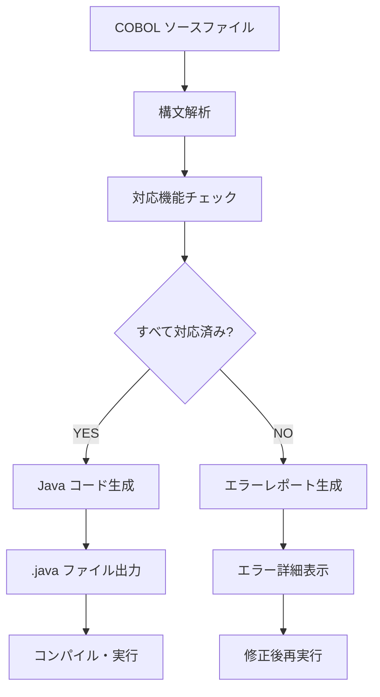

# COBOLリファクタリング

OpenASP プロジェクトにおけるCOBOLコードのリファクタリングおよび変換に関するドキュメントです。

## 概要

OpenASP では、レガシーCOBOLシステムを現代的なJava環境に移行するためのツールと手法を提供しています。本ドキュメントでは、COBOLからJavaへの変換プロセスと具体的な使用方法について説明します。

---

## COBOL TO JAVA

### 概要

COBOL to Java変換ツールは、COBOLソースコードを解析し、対応するJavaコードに自動変換するコマンドラインツールです。実際のCOBOL構文をパースし、サンプルデータに依存しない本格的な変換を行います。

### 特徴

- ✅ **リアルタイム解析**: 実際のCOBOL構文を解析
- ✅ **エラー検出**: サポートされていない機能を事前に検出
- ✅ **安全な変換**: 変換可能な場合のみJavaコードを生成
- ✅ **日本語対応**: 日本語プロンプトとメッセージ
- ✅ **ファイル処理**: データファイルI/Oに対応

### インストールと設定

変換ツールは `/data/cobol-converter.js` に配置されています。

#### 必要環境
- Node.js (v12以上)
- Java Runtime Environment (生成されたJavaコード実行用)

#### ファイル配置
```
/data/
├── cobol-converter.js          # メイン変換ツール
├── COBOL2Java/samples/         # サンプルCOBOLファイル
└── COBOL2Java/output/          # 変換結果出力先
```

### 使用方法

#### 基本コマンド構文
```bash
node /data/cobol-converter.js <入力ファイル.cob> [出力ファイル.java] [オプション]
```

#### コマンドオプション

| オプション | 短縮形 | 説明 |
|-----------|--------|------|
| `--help` | `-h` | ヘルプメッセージを表示 |
| `--verbose` | `-v` | 詳細な変換情報を表示 |
| `--check-only` | `-c` | 変換可能性のみチェック（ファイル出力なし） |

#### 使用例

**1. 基本的な変換**
```bash
node /data/cobol-converter.js TAX01.cob
```

**2. 出力ファイル名を指定**
```bash
node /data/cobol-converter.js TAX01.cob MyTaxProgram.java
```

**3. 詳細情報付き変換**
```bash
node /data/cobol-converter.js TAX01.cob --verbose
```

**4. 変換可能性チェック**
```bash
node /data/cobol-converter.js PAYROLL.cob --check-only
```

**5. ヘルプ表示**
```bash
node /data/cobol-converter.js --help
```

### 対応するCOBOL機能

#### ✅ サポート済み機能

| 分類 | COBOL文 | 説明 |
|------|---------|------|
| **プログラム構造** | `PROGRAM-ID` | プログラム識別 |
| **データ定義** | `WORKING-STORAGE SECTION` | 作業領域定義 |
| **ファイル制御** | `FILE-CONTROL`, `FILE SECTION` | ファイル定義 |
| **表示・入力** | `DISPLAY`, `ACCEPT FROM CONSOLE` | 画面I/O |
| **データ操作** | `MOVE`, `COMPUTE`, `MULTIPLY`, `ADD` | データ計算 |
| **制御構造** | `IF...END-IF`, `EVALUATE...END-EVALUATE` | 条件分岐 |
| **反復制御** | `PERFORM`, `PERFORM UNTIL...END-PERFORM` | ループ処理 |
| **ファイル操作** | `OPEN INPUT`, `READ...AT END`, `CLOSE` | ファイルI/O |
| **その他** | `SET`, `STOP RUN` | 制御文 |

#### ❌ 未対応機能（エラーとなる）

| COBOL文 | 理由 |
|---------|------|
| `CALL` statements | サブプログラム呼び出し未対応 |
| `SORT` statements | ソート処理未対応 |
| `OCCURS` clauses | 配列処理未対応 |
| `REDEFINES` clauses | メモリ再定義未対応 |
| `COPY` statements | インクルード処理未対応 |

### 実行例とその結果

#### 例1: 成功ケース - TAX01.cob

**実行コマンド:**
```bash
node /data/cobol-converter.js /data/COBOL2Java/samples/TAX01.cob --verbose
```

**実行結果:**
```
📝 Reading COBOL file: /data/COBOL2Java/samples/TAX01.cob
📏 File size: 2394 characters
📄 Lines: 70
🔄 Starting conversion...
✅ Conversion successful!
📦 Generated class: Tax01
📊 Java code size: 2470 characters
💾 Java file written: Tax01.java

🎯 Next steps:
   1. Compile: javac Tax01.java
   2. Run: java Tax01
   3. Ensure /data directory exists for file operations
```

**生成されたJavaコードの実行:**
```bash
# コンパイル
javac Tax01.java

# 実行
java Tax01
```

**プログラム実行例:**
```
所得税計算システム
==================
年収を入力（円）: 5000000

所得税計算結果
================
年収　　　：¥5,000,000 円
基礎控除　：¥480,000 円
課税所得　：¥4,520,000 円
所得税額　：¥904,000 円
住民税額　：¥90,400 円
手取り年収：¥4,005,600 円
```

#### 例2: エラーケース - 未対応機能を含むCOBOL

**入力ファイル（test-unsupported.cob）:**
```cobol
IDENTIFICATION DIVISION.
PROGRAM-ID. TEST-UNSUPPORTED.

DATA DIVISION.
WORKING-STORAGE SECTION.
01 WS-NAME PIC X(30).
01 WS-TABLE OCCURS 10 TIMES PIC X(10).

PROCEDURE DIVISION.
MAIN-PROCEDURE.
    DISPLAY "This program has unsupported features"
    CALL "SUBPROGRAM"
    SORT WS-FILE ON ASCENDING KEY WS-NAME
    COPY "COPYBOOK.cpy"
    STOP RUN.
```

**実行コマンド:**
```bash
node /data/cobol-converter.js test-unsupported.cob --verbose
```

**実行結果:**
```
📝 Reading COBOL file: test-unsupported.cob
📏 File size: 490 characters
📄 Lines: 17
🔄 Starting conversion...
❌ Conversion failed!

🚫 Unsupported features found:
   • CALL statements not supported: CALL "SUBPROGRAM"
   • SORT statements not supported: SORT WS-FILE ON ASCENDING KEY WS-NAME
   • COPY statements not supported: COPY "COPYBOOK.cpy"
   • OCCURS clauses (arrays) not supported: 01 WS-TABLE OCCURS 10 TIMES

💡 Recommendations:
   • Remove or replace unsupported COBOL features
   • Use only basic COBOL statements (DISPLAY, ACCEPT, MOVE, IF, PERFORM)
   • Check the supported features list with --help

📋 Error report written: TestUnsupported.java
```

#### 例3: チェックモード - 変換可能性の確認

**実行コマンド:**
```bash
node /data/cobol-converter.js TAX01.cob --check-only
```

**実行結果:**
```
✅ Conversion successful!
```

### トラブルシューティング

#### よくある問題と解決方法

**1. ファイルが見つからない**
```
❌ Error: Input file not found: filename.cob
```
**解決方法:** ファイルパスを確認し、正しいパスを指定してください。

**2. 無効なファイル拡張子**
```
❌ Error: Invalid file extension. Expected .cob, .cobol, or .txt
```
**解決方法:** COBOLファイルの拡張子を `.cob`, `.cobol`, または `.txt` に変更してください。

**3. 未対応機能エラー**
```
❌ Conversion failed!
🚫 Unsupported features found:
```
**解決方法:** エラーメッセージで示された未対応機能を削除または置換してください。

#### デバッグ方法

**詳細ログの有効化:**
```bash
node /data/cobol-converter.js input.cob --verbose
```

**変換可能性の事前確認:**
```bash
node /data/cobol-converter.js input.cob --check-only
```

### 変換フロー



### ベストプラクティス

#### 1. 変換前の準備
- COBOLコードの構文チェック
- 未対応機能の事前確認（`--check-only`使用）
- データファイルの準備（ファイルI/Oがある場合）

#### 2. 段階的変換
1. **小さなプログラムから開始**
2. **基本機能のみのプログラムで動作確認**
3. **徐々に複雑なプログラムに適用**

#### 3. 品質保証
- 変換後のJavaコードのコンパイル確認
- 元のCOBOLプログラムとの動作比較
- テストケースによる検証

### 今後の拡張予定

#### 対応予定機能
- [ ] `OCCURS`句（配列）のサポート
- [ ] `CALL`文の限定的サポート
- [ ] `COPY`文の展開機能
- [ ] より高度なファイル処理

#### パフォーマンス改善
- [ ] 大規模ファイルの並列処理
- [ ] 変換結果のキャッシュ機能
- [ ] 増分変換サポート

---

## 関連ドキュメント

- [プロジェクト標準仕様](PROJECT_STANDARDS.md)
- [OpenASP アーキテクチャ](../README.md)
- [API リファレンス](API_REFERENCE.md)

---

*OpenASP Project Team - 2025*
*最終更新: 2025年7月6日*